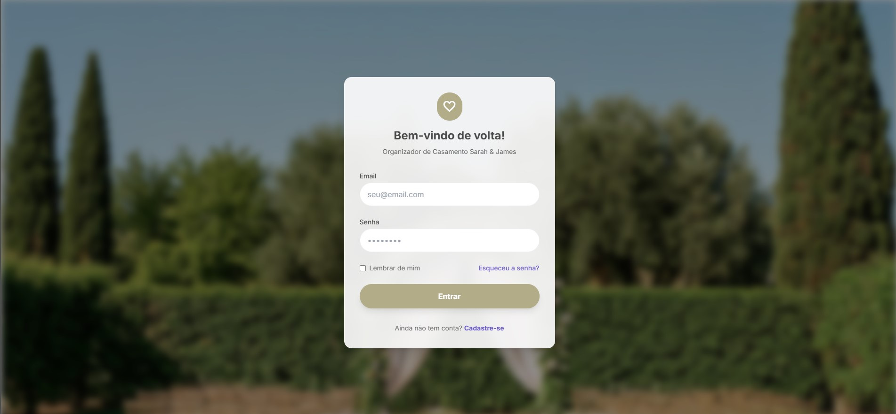

# Wedding Planner 💍


Aplicação moderna para planejamento de casamentos, oferecendo um dashboard intuitivo para gestão de convidados, orçamentos e cronogramas. O sistema simplifica a organização do grande dia com uma interface elegante e funcional.



## 🚀 Visão Geral e Arquitetura

Este projeto é uma **SPA (Single Page Application)** focada em experiência do usuário e design responsivo:

- **Frontend**: Construído com **Vue 3 (Composition API)** e **Vite**, garantindo alta performance e desenvolvimento ágil.
- **Estilização**: Utiliza **Tailwind CSS** com uma paleta de cores personalizada (Sage Green & Lavender) e componentes inspirados no **Material Design 3**.
- **Roteamento**: Navegação fluida via **Vue Router**.

## ✨ Funcionalidades Detalhadas

### 📊 Dashboard Interativo
- **Resumo Geral**: Visualização rápida de estatísticas de convidados (Total vs Confirmados).
- **Widgets Dinâmicos**: Cards de "Próximos Eventos" e "Prioridades da Semana" com navegação em abas.
- **Ações Rápidas**: Botões de acesso direto para adicionar despesas, eventos e convidados.
- **Contagem Regressiva**: Hero section com contador para o dia do casamento.

### 👥 Gestão de Convidados
- **Lista Completa**: Visualização de todos os convidados com status de confirmação (RSVP).
- **Categorização**: Filtros visuais por grupos (Família, Amigos, Trabalho) e dietas.
- **Estatísticas**: Gráficos circulares de confirmação de presença.

### 🎨 Design System
- **Paleta Harmoniosa**: Tons de Sage Green, Lavanda e Terracota para uma estética sofisticada.
- **Componentes Reutilizáveis**: Cards, Chips de Status, Botões e Modais padronizados.
- **Responsividade**: Layout adaptável para desktop e mobile.

## 🛠️ Tecnologias Utilizadas

### Frontend
- **Framework**: Vue.js 3.5+
- **Build Tool**: Vite
- **CSS Framework**: Tailwind CSS 3.4
- **Router**: Vue Router 4
- **Ícones**: Google Material Symbols

## 📦 Instalação e Configuração

### Pré-requisitos
- Node.js (LTS) & NPM

### Passo a Passo

1.  **Clone o repositório**:
    ```bash
    git clone https://github.com/brunocarlos7/wedding-planner.git
    cd wedding-planner
    ```

2.  **Instale as dependências**:
    ```bash
    npm install
    ```

3.  **Execute a aplicação**:
    ```bash
    npm run dev
    ```

4.  Acesse em: `http://localhost:5173`

## 📚 Estrutura do Projeto

```
src/
├── components/     # Componentes Vue reutilizáveis (Dashboard, Layout, Common)
├── views/          # Páginas da aplicação (DashboardView, GuestListView)
├── router/         # Configuração de rotas
├── assets/         # Imagens e estilos globais
└── App.vue         # Componente raiz
```

## 🤝 Contribuição

Contribuições são bem-vindas! Sinta-se à vontade para abrir issues ou enviar pull requests com melhorias.

## 📄 Licença


## 📱 Acesso Mobile / Rede Local

Para acessar o projeto pelo seu celular ou outro computador na mesma rede Wi-Fi:

1.  **Descubra seu IP Local**:
    - No terminal, execute `ipconfig` (Windows) e procure por `IPv4 Address` (ex: `192.168.1.5`).

2.  **Execute o comando de host**:
    ```bash
    npm run dev:host
    ```

3.  **Acesse no dispositivo**:
    - Abra o navegador do celular e digite: `http://SEU_IP_LOCAL:5173`
    - Exemplo: `http://192.168.1.5:5173`

> **Nota**: Certifique-se de que o Firewall do Windows permita a conexão (selecione "Redes Privadas" se solicitado).

